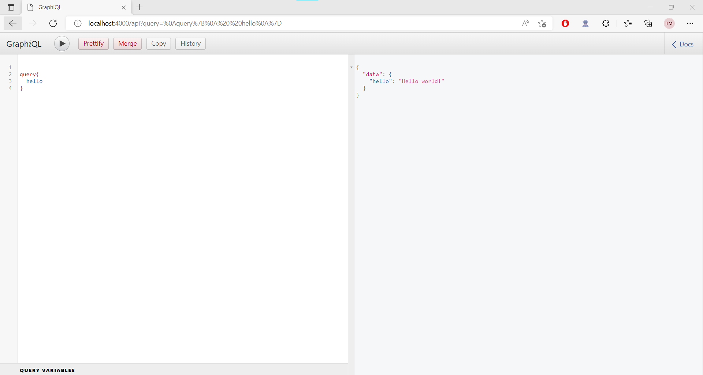

# GraphQL-Server-Node.js-Express

### Let's Start

##### Install the dependencies
 npm install

##### Start the server
 node server.js

Creating A GraphQL Server With Node.js And Express

1. Installing the required dependencies
   Before getting started, there are a few things you need in addition to the express package. You'll need to install express-graphql, an HTTP middleware that will be leveraged by Express to rapidly create your API and the official graphql implementation.

You can do so by running the following command in the root directory of your project:

npm install express express-graphql graphql --save

2. Creating an entry point
   After you've installed the necessary dependencies, you’ll need to make an entry point to your API. To do so, create a file named server.js at the root of your project.

This way, you can start your server with the simple command node server.js.

3. Importing the dependencies
   Once your file is generated, you can import the required dependencies installed in the previous step.

Simply insert the following code at the start of the server.js file:

4. Building a GraphQL schema and a first resolver
   For GraphQL to work, you need to define what will be queried by a client with the help of a schema. For starters, you’ll make the API return Hello world! whenever a user requests it.

To do so, define your schema programmatically using the GraphQLObjectType. This new variable will define all the fields that can be queried at the first level.

Your GraphQL API needs to know what value(s) to return. To do so, you need to create what we call resolvers. In this case, you only want to return "Hello world!" whenever the user queries hello. So, inside the hello field, I had to define what type was going to be returned by the resolver as well as the resolver itself.

5. Building the Node.js Express app
   The latest step to get a basic GraphQL API working is creating the Express server.

Here, I’ve set up a single route for the API and then pass as a parameter the graphqlHTTP middleware in which we set the schema and the graphiql flag.

Setting the graphiql flag as true will automatically set up a GraphIQL playground, which allows you to query your API with code completion.

If you run node server.js in the command prompt and visit localhost:4000/api in your web browser, the API should be live and queryable!
